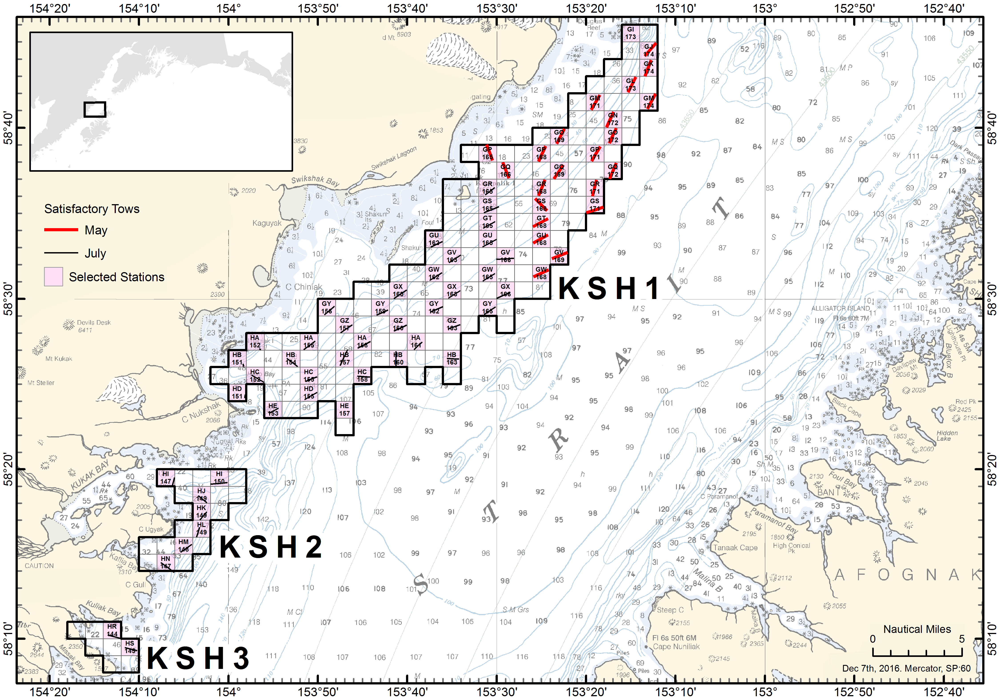
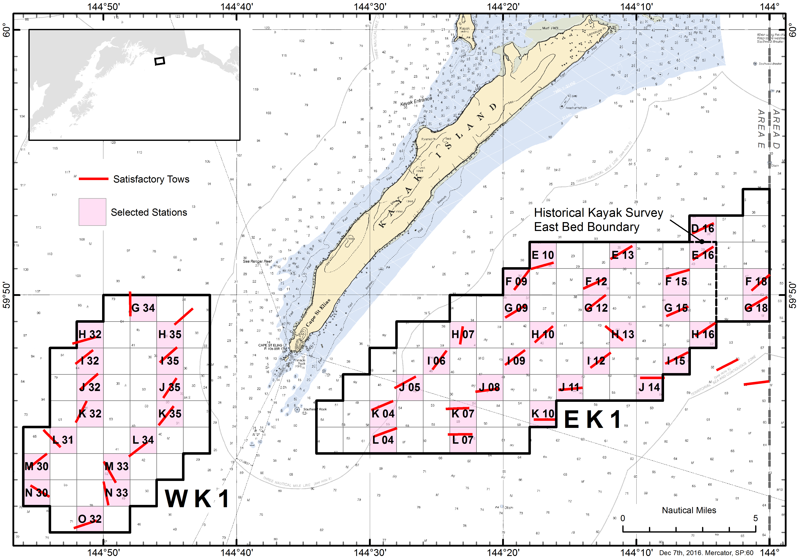
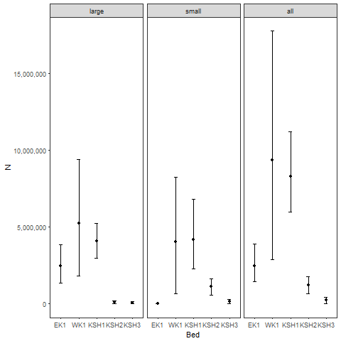
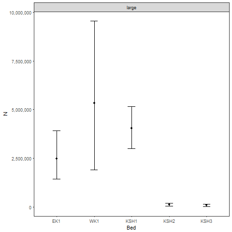

#ABSTRACT  

#INTRODUCTION
Weathervane scallops, Patinopecten caurinus, are distributed in the northeast Pacific Ocean from Pt. Reyes, California north to the Pribilof Islands in the Bering Sea, and west to the Aleutian Islands, and occur from the intertidal to 300 m (Foster 1991). Scallops are a long-lived species, attaining ages between 20 and 28 years in Alaska waters (Hennick 1973; Bechtol et al. 2009). Densities that support commercial harvest typically occur between 45 and 130 m on discrete aggregations (or beds) (Kruse et al. 2005), and in a wide variety of habitats ranging from rock and gravel to silt and mud (Hennick 1973). Scallop beds are typically elongated or elliptical in shape and oriented in the direction of mean current flow (Kruse et al. 2000).

In Alaska, dredge based fishery-independent surveys have been restricted to Kayak Island and Cook Inlet areas. Initial surveys were conducted for Kamishak Bay and Kayak Island in 1984 and 1996, respectively (Hammarstrom and Merritt 1985, Bechtol et al. 2003), and have been conducted biennially since 1996 (Gustafson and Goldman 2012). These surveys have enabled the department to (1) delineate the primary scallop beds; (2) estimate scallop abundance and biomass within these beds; (3) define bed composition through age and shell height data; and (4) estimate bycatch rates of non-target species, particularly Tanner crab. Fishery managers have used the results of these surveys to set guideline harvest limits (GHLs) and manage the commercial scallop fishery in the Cook Inlet and Prince William Sound registration areas. All other management areas in the state are reliant on fishery-dependent data gathered from the statewide scallop observer program to inform management decisions (NPFMC 2015).

#OBJECTIVES  
##Primary  
 1. Estimate catch rates and abundance of scallops by survey area with a coefficient of variation (CV) ≤ 20%.
 2. Collection of biological data (e.g., shell height, meat weight, age) for estimation of growth, mortality, and biomass.  

##Secondary  
 1. Record incidental catch (numbers and weight) of commercially important species and scallop predators.
 
##Tertiary  
 1. Address particular area management concerns.
 2. Special short term projects.
 
#METHODS  
Survey design and implementation procedures are detailed in the statewide scallop survey operational plan (reference).  Sample collection is also detailed there. 

Scallop samples are analyzed in each survey area (bed) and categorized by size-class, large (>= 100 mm) and small (< 100 mm). 

Scallop abundance estimation based upon area-swept calculations where scallop density $d_i$ is calculated as:

$$d_i=\frac{c_i}{a_i},$$  
where  
$$a_i=l_i\cdot dw\cdot Q,$$  
and  
$$\bar d = \frac{1}{s}\sum_{i=1}^{s} d_i.$$
where: 

$c_i$ = the catch of a species, either as abundance or weight, in sample haul *i*,  
$a_i$ = the nmi^2^ sampled in haul *i*,  
$l_i$ = the nmi towed for sample haul *i*,  
*dw* = the dredge width in nmi,   
*Q* = dredge efficency, and   
*s* = the number of stations sampled.  

A preliminary *Q* of 0.83 calculated from the Kayak Island beds in 2004 [@Gustafson2012] was used in lieu of bed specific efficiencies. Density variance was calculated using a nonparametric bootstrap resampling procedure with replacement.  Bootstrap percentile intervals were used to estimate 95% confidence intervals.  


An estimate of the surveyed population $\hat{N}$ was calculated by expanding $\bar{d}$ over the defined bed area *A* encompassing all grid cells as: 

$$
\hat{N}=A\bar{d}.
$$

Variance and confidence intervals for the surveyed population $\hat{N}$ were also estimated from the nonparametric bootstrap procedure.  

An estimate of the surveryed population by round weight in pounds $\hat{RW}$ was also be calculated using the same equations as above.  

Meat weight biomass(lb) available by bed was calculated based on two alternative methods. A comparison of these methods was performed and the less variable method used. Both methods use the meat weight ratio calculated from the subsample of 10 large individuals from each tow (where they were available).  For every individual the meat weight ratio is calulated as: 
$$
r = \frac{MW (g)}{RW (g)}
$$
A nonparametric bootstrap procedure was used to estimate the mean ratio $\bar r$, variance, and percentile confidence intervals for each survey area (bed).  

The first method to estimate meat weight (lb) by survey area used the estimated abundance $\hat{N}$ in each bed and the mean individual round weight $\bar{RW}$ per bed:
$$
MWbed_1 = \hat{N}\bar r\bar {RW}
$$
The second method to estimate meat weight (lb) applied the same meat weight ratio $\bar R$ to the estimated round weight $\hat{RW}$(lb) of large scallops by bed.  The round weight of large scallops by bed was calculated using the average density of scallop round weight by bed multipled by the area of each bed (see above, Table 3) :
$$
MWbed_2 = \hat{RW}\bar r\
$$
Confidence intervals for the meat weight (lb) estimates were calculated (using the above equation) from the nonparametric bootstraps performed on the abundance estimates (both $\hat{N}$ and $\hat{RW}$) and the mean ratio $\bar r$.  

where: 

*r* = ratio of round weight to meat weight for each individual,  
*MW* = meat weight, and  
*RW* = round weight.


The density and abundance (by weight) of clappers

#RESULTS  
###Scallop denisty and abundance
Successful tows were performed in all five beds during either the May or July surveys (Figs 1 and 2). The average scallop density and abundance by bed were estimated along with their respective confidence intervals, and coefficient of variation (CV) (Tables 1, 2, and 3). Scallop abundance calculations were performed for both size classes (small and large) and for all scallop combined (all). 

```{r, echo=F, message=F, warning=F}
library(knitr)
a <- read.csv('../output/bed_sum_table_Ndbar.csv')
library(tidyverse)
options(scipen=9999) # remove scientific notation

a %>% filter(Bed=='WK1', variable=='all') -> wk1
```
  

###Meat weight
Estimations of the meat weight ratio (round weight/ meat weight) were done using only large scallops that were sampled at a rate of approximately 10 per tow (Table 3).  The average meat weight ratio, along bootstrap confidence intervals, was calculated and applied to the abundance estimates to get a range of meat weight (in pounds - lb) available by bed using two methods (Table 4 and 5). For illustration purposed only a rate of 5% was applied to the availalble meat weight by bed to get a hypothetical meat weight GHL. The method in Table 3, using individual weights, was less variable in all beds, with the exception of WK1.  In WK1 the variablity around the meat weight estimate was higher using the individual weights, but the point estimates were similar.  

###Scallop height distribution by bed
? Histograms of scallop height by bed

#DISCUSSION  
The primary objective of this survey was to estimate scallop abundance by survey area with a coefficient of variation (CV) ≤ 20%.  From the results reported in Table 1, only EK1 and KSH1 were close to that level.  Additional sampling would be recommended to achieve a smaller CV in the other three survey areas (KSH2, KSH3, and WK1).  A power analyis can be performed prior to survey implementation to determine the desired sample rate to reduce the CV.  

Bed specific discussion of results???
The western Kayak Island abundance estimate of all scallops was ```r round(wk1$N_b)``` with 95% CI of ```r round(wk1$llN)``` - ```r round(wk1$ulN)```.

The subsample of scallops collected for more detailed biological data was set at a desired random subsample of 40 individuals.  Ten of these (large only) were further sampled to determine a meat weight to round weight ratio. A goodness-of-fit test (K-S test) was performed for each tow to confirm that the 10 random samples were representative of the 40 subsampled.  Using only the tows that had adequate sampling of large scallops (n>11) the majority of the time these 10 samples represented the entire subsample well (90% of the time). 

Estimates of natural mortality from clappers? if so how?


##Tables:
###Abundance estimates by numbers
**Table 1:** CV of abundance for large scallops by bed, also sample size and area by bed
``````{r, echo=F, message=F, warning=F}
library(knitr)
a <- read.csv('../output/bed_sum_table_Ndbar.csv')
b <- read.csv('../output/original_numbers_NO_BOOT.csv')
library(tidyverse)
options(scipen=9999) # remove scientific notation
b %>%
  group_by(year, Bed) %>%
  summarise (n = mean(n), area = mean(area)) ->n_area
a %>% 
  filter(variable == 'large')%>%
  mutate(dbar = round(dbar_b), cv = round(cv), N = round(N_b), cvN = round(cvN), size.class = variable) %>%
  select(year, Bed, size.class, N, cvN) %>% 
  left_join(n_area) %>% kable()
```

**Table 2:** Estimates of abundance and density with 95% bootstrap confidence intervals
```{r, echo=F, message=F, warning=F}
library(knitr)
a <- read.csv('../output/bed_sum_table_Ndbar.csv')
library(tidyverse)
options(scipen=9999) # remove scientific notation
a %>% mutate(N=round(N_b),N_UL=round(ulN),N_LL=round(llN),dbar=round(dbar_b),dbar_UL=round(uldbar),dbar_LL=round(lldbar), size.class = variable) %>% select(Bed, size.class, N,N_UL,N_LL,dbar,dbar_UL,dbar_LL) %>% kable()

a %>% filter(Bed=='WK1', variable=='all') -> wk1
```

**Table 3:** Estimates of round weight (lb) with 95% bootstrap confidence intervals for large scallops by bed.
```{r, echo=F, message=F, warning=F}
library(knitr)
f <- read.csv('../output/bed_weights_table_Ndbar.csv')
library(tidyverse)
options(scipen=9999) # remove scientific notation
f %>% filter(variable == 'large') %>% mutate(RW=round(N_lb),RW_UL=round(ulN),RW_LL=round(llN), size.class = variable) %>% select(Bed, year, size.class, RW, RW_UL, RW_LL) %>% kable()

```


##Meat Weight with large scallops ONLY

**Table 4:** Meat weight (lb) by bed from individual scallops with 95% bootstrap confidence intervals using estimated numbers of large scallops per bed
```{r, echo=F, message=F, warning=F}
library(knitr)
d <- read.csv('../output/bed_meatwt_table_Ndbar.csv')
library(tidyverse)
options(scipen=9999) # remove scientific notation
d %>% mutate(N=round(N_b),N_UL=round(ulN),N_LL=round(llN),ratio =round(ratio_bar, 3), ratio_LL=round(ll, 3),ratio_UL=round(ul,3)) %>% select(Bed, N,N_UL,N_LL,weight, ratio, min_meat_wt, meat_wt, max_meat_wt, meat_0.05) %>% kable()
```


**Table 5:** Meat weight (lb) by bed using weights from tows NOT individual weights 
```{r, echo=F, message=F, warning=F}
library(knitr)
e <- read.csv('../output/weights_meatwt_table.csv')
library(tidyverse)
options(scipen=9999) # remove scientific notation
e %>% mutate(W_lb=round(N_lb),W_UL=round(ulN),W_LL=round(llN),ratio =round(ratio_bar, 3), ratio_LL=round(ll, 3),ratio_UL=round(ul,3)) %>% select(Bed, W_lb,W_UL,W_LL,ratio, min_meat_wt, meat_wt, max_meat_wt, meat_0.05) %>% kable()
```

##Figures:












  


#REFERENCES


