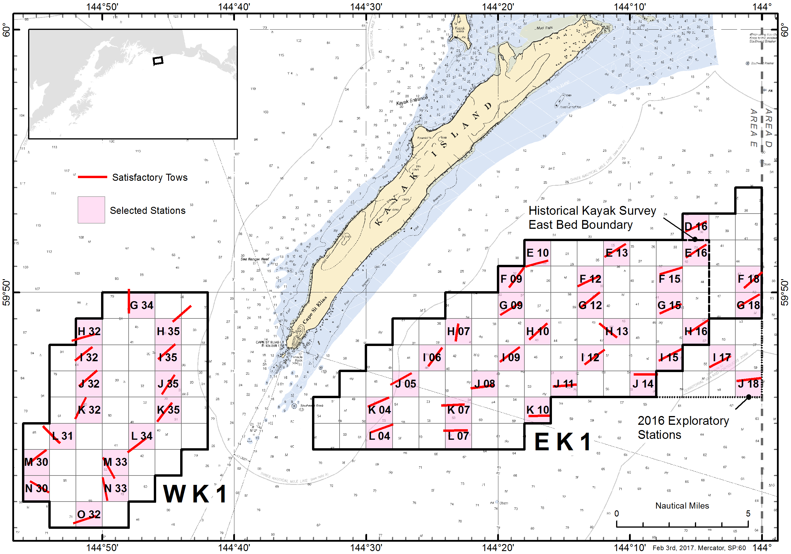
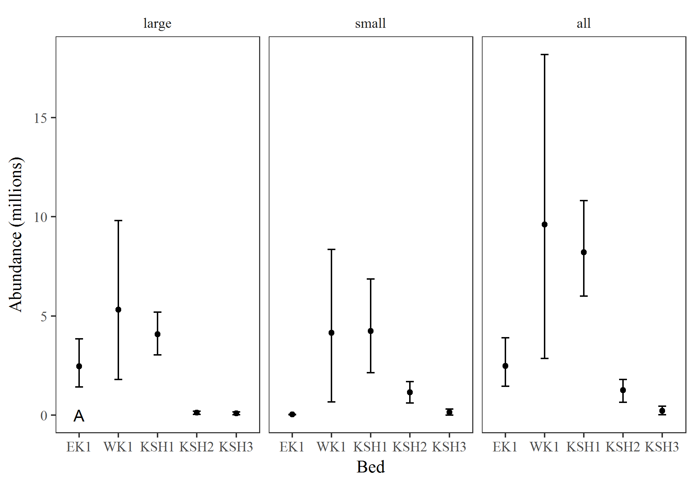
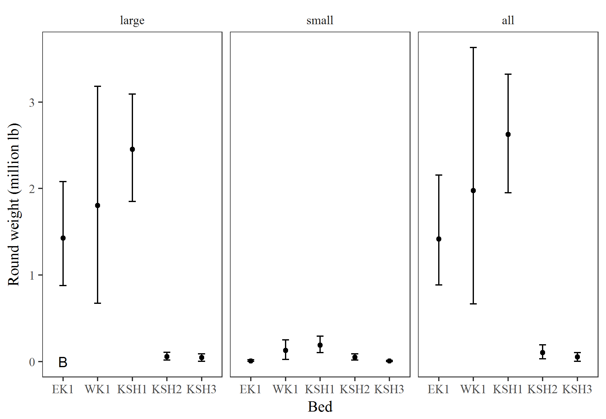

#ABSTRACT  

#INTRODUCTION
Weathervane scallops, Patinopecten caurinus, are distributed in the northeast Pacific Ocean from Pt. Reyes, California north to the Pribilof Islands in the Bering Sea, and west to the Aleutian Islands, and occur from the intertidal to 300 m [@Foster1991]. Scallops are a long-lived species, attaining ages between 20 and 28 years in Alaska waters [@Hennick1973, @Bechtol2009]. Densities that support commercial harvest typically occur between 45 and 130 m on discrete aggregations (or beds) [@Kruse2005], and in a wide variety of habitats ranging from rock and gravel to silt and mud [@Hennick1973]. Scallop beds are typically elongated or elliptical in shape and oriented in the direction of mean current flow [@Kruse2000].

In Alaska, dredge based fishery-independent surveys have been restricted to Kayak Island and Cook Inlet areas. Initial surveys were conducted for Kamishak Bay and Kayak Island in 1984 and 1996, respectively [@Hammarstrom1985, @Bechtol2003], and have been conducted biennially since 1996 [@Gustafson2012]. These surveys have enabled the department to (1) delineate the primary scallop beds; (2) estimate scallop abundance and biomass within these beds; (3) define bed composition through age and shell height data; and (4) estimate bycatch rates of non-target species, particularly Tanner crab. Fishery managers have used the results of these surveys to set guideline harvest limits (GHLs) and manage the commercial scallop fishery in the Cook Inlet and Prince William Sound registration areas. All other management areas in the state are reliant on fishery-dependent data gathered from the statewide scallop observer program to inform management decisions [@NPFMC2015].

#OBJECTIVES  
##Primary  
 1. Estimate catch rates and abundance of scallops by survey area with a coefficient of variation (CV) $\leq$ 20%.
 2. Collection of biological data (e.g., shell height, meat weight, age) for estimation of growth, mortality, and biomass.  

##Secondary  
 1. Record incidental catch (numbers and weight) of commercially important species and scallop predators.
 
##Tertiary  
 1. Address particular area management concerns.
 2. Special short term projects.
 
#METHODS  
Survey design and implementation procedures are detailed in the statewide scallop survey operational plan (**REFERENCE**).  Sample collection is also detailed there. 

Scallop samples are analyzed in each survey area (bed) and categorized by size-class, large ($\geq$ 100 mm) and small (< 100 mm). 

Scallop abundance estimation based upon area-swept calculations where scallop density $d_i$ is calculated as:

$$d_i=\frac{c_i}{a_i},$$  
where  
$$a_i=l_i\cdot dw\cdot Q,$$  
and  
$$\bar d = \frac{1}{s}\sum_{i=1}^{s} d_i.$$
where: 

$c_i$ = the catch of a species, either as abundance or weight, in sample haul *i*,  
$a_i$ = the nmi^2^ sampled in haul *i*,  
$l_i$ = the nmi towed for sample haul *i*,  
*dw* = the dredge width in nmi,   
*Q* = dredge efficency, and   
*s* = the number of stations sampled.  

A preliminary *Q* of 0.83 calculated from the Kayak Island beds in 2004 [@Gustafson2012] was used in lieu of bed specific efficiencies. 
Density variance was calculated using a nonparametric bootstrap resampling procedure with replacement. 
Bootstrap percentile intervals were used to estimate 95% confidence intervals.  


An estimate of the surveyed population $\hat{N}$ was calculated by expanding $\bar{d}$ over the defined bed area *A* encompassing all grid cells as: 

$$
\hat{N}=A\bar{d}.
$$

Variance and confidence intervals for the surveyed population $\hat{N}$ were estimated using a nonparametric bootstrap procedure.  

An estimate of the surveyed population by round weight in pounds $\hat{RW}$ was also calculated using the same equations as above.  

Avaiable meat weight biomass (lb) was calculated for each bed using two methods. 
A comparison of these methods was performed and the less variable method used. 
Both methods use the meat/round weight ratio calculated from the subsample of 10 large individuals from each tow (where available).  
For every individual the meat weight ratio was calculated as: 
$$
r = \frac{MW (g)}{RW (g)}
$$
A nonparametric bootstrap procedure was used to estimate the mean ratio $\bar r$, variance, and percentile confidence intervals for each bed.  

The first meat weight estimation method was calculated using the estimated abundance $\hat{N}$ in each bed and the mean individual round weight $\bar{RW}$ per bed:
$$
MW_1 = \hat{N}\bar r\bar {RW}
$$
The second meat weight estimation method applied the same meat weight ratio $\bar r$ to the estimated round weight $\hat{RW}$(lb) of large scallops by bed.  The round weight of large scallops by bed was calculated using the average density of scallop round weight by bed multipled by the area of each bed (see above, Table 3) :
$$
MW_2 = \hat{RW}\bar r\
$$
Confidence intervals for the meat weight (lb) estimates were calculated (using the above equations) from the nonparametric bootstraps performed on the abundance estimates (both $\hat{N}$ and $\hat{RW}$) and the mean ratio $\bar r$.  

*The abundance (by weight) of empty shells, aka clappers, per bed was calculated using the same procedure as live scallops. The clapper abundance by bed was then used to estimate the percentage of clappers by bed. This value may be helpful to understand natural mortality in each survey area.*

#RESULTS  
##Scallop density and abundance  

**Discussion of vessel break down and change out**

Successful tows were performed in five beds during either the May or July surveys (Figs 1 and 2). The average scallop density and abundance by bed were estimated along with their respective confidence intervals, and coefficient of variation (CV) (Tables 1, 2, and 3). Scallop abundance calculations were performed for both size classes (small and large) and for all scallop combined (all). 

The Kodiak District Shelikof 1 bed was within the target CV when examined by number of scallops, no other area met the target CV (Table 1). Scallop density and abundance were highest for the Western Kayak Island bed (Table 2), though round weights were greatest in the Kodiak District Shelikof 1 bed (Table 3). The CV for round weight estimates was similar to the numbers based CV for all beds (Tables 1 and 3).


```{r, echo=F, message=F, warning=F}
library(knitr)
library(tidyverse)
options(scipen=9999) # remove scientific notation


a <- read.csv('../output/N_summary.csv')
a %>% filter(Bed=='WK1', variable=='all') -> wk1
```
  

###Meat weight
Estimations of the meat weight ratio (round weight/ meat weight) were done using only large scallops that were sampled at a rate of approximately 10 per tow (Table 3).  The average meat weight ratio, along bootstrap confidence intervals, was calculated and applied to the abundance estimates to get a range of meat weight (in pounds - lb) available by bed using two methods (Table 4 and 5). For illustration purposed only a rate of 5% was applied to the available meat weight by bed to get a hypothetical meat weight GHL. The method in Table 3, using individual weights, was less variable in all beds, with the exception of WK1.  In WK1 the variablity around the meat weight estimate was higher using the individual weights, but the point estimates were similar.  

###Scallop height distribution by bed
? Histograms of scallop height by bed

###Clappers
The abundance (by weight) of clappers was calculated by bed.
It was then evaluated, along with the abundance (by weight) of live scallops to estimate the percentage of clappers by bed (Table 6).
These estimates are higher than expected and further review of the assumptions and methods behind this analysis is recommended.   

#DISCUSSION  
The primary objective of this survey was to estimate scallop abundance by survey area with a coefficient of variation (CV) $\leq$ 20%.  From the results reported in Table 1, only EK1 and KSH1 were close to that level.  Additional sampling would be recommended to achieve a smaller CV in the other three survey areas (KSH2, KSH3, and WK1).  A power analyis can be performed prior to survey implementation to determine the desired increased sample rate to reduce the CV.  

Bed specific discussion of results???  

The western Kayak Island abundance estimate of all scallops was ```r prettyNum(wk1$N_b, big.mark=",")``` with 95% CI of ```r prettyNum(wk1$llN, big.mark=",")``` - ```r prettyNum(wk1$ulN, big.mark=",")```.

The subsample of scallops collected for more detailed biological data was set at a desired random subsample of 40 individuals.  Ten of these (large only) were further sampled to determine a meat weight to round weight ratio. A goodness-of-fit test (K-S test) was performed for each tow to confirm that the 10 random samples were representative of the 40 subsampled.  Using only the tows that had adequate sampling of large scallops (n>11) the majority of the time these 10 samples represented the entire subsample well (90% of the time). 

A secondary objective of this study was to estimate natural mortality from the presence of clapper (empty shells) in the tows.  The abundance (by weight) of clappers and their associated percent composition were calculated for each bed.  However, the preliminary percent composition numbers are higher than expected for a long-lived sedentary species (reference?).  Further review of the analysis methods is required before these estimated could be used as a proxy for natural mortality. 


# TABLES

``````{r, echo=F, message=F, warning=F}
a <- read.csv('../output/N_summary.csv')
b <- read.csv('../output/numbers_original.csv')

column_names = c('Bed', 'Area', 'Sample', 'N', 'CV')
b %>%
  group_by(year, Bed) %>%
  summarise (sample_size = mean(n), area = mean(area)) %>% left_join(a) %>% 
  filter(variable == 'large')%>%
		mutate(id = c(1,3,4,5,2)) %>% 
	arrange(id) %>% 
  mutate(dbar = round(dbar_b), cv = round(cv), N = round(N_b), CV = round(cvN), size.class = variable) %>% ungroup %>% 
   dplyr::select(Bed, area, sample_size, N, CV, -year) %>%  
   mutate_each(funs(prettyNum(., big.mark=","))) %>% 
   kable( ,col.names = column_names, caption = "Estimates of large scallop abundance and CV by bed.")
```


```{r t.N_dbar, echo=F, message=F, warning=F}

column_names = c('Bed', 'Size class', 'N', 'LL', 'UL', 'Density', 'D LL','D UL' )

a %>% 
   mutate(N=round(N_b),
          N_UL=round(ulN),
          N_LL=round(llN),
          dbar=round(dbar_b),
          dbar_UL=round(uldbar),
          dbar_LL=round(lldbar)) %>% 
	mutate(id = c(rep(1,3),rep(3,3),rep(4,3),rep(5,3),rep(2,3))) %>% 
	arrange(id, variable) %>% 
   select(Bed, variable, N,N_LL,N_UL,dbar,dbar_LL,dbar_UL) %>% 
   mutate_each(funs(prettyNum(., big.mark=","))) %>%  mutate_each(funs(prettyNum(., big.mark=","))) %>%  
   kable(,col.names = column_names, caption = "Estimates of abundance and density with 95% bootstrap confidence intervals")
```


```{r, echo=F, message=F, warning=F}
f <- read.csv('../output/weights_summary.csv')
column_names = c('Bed', 'Weight', 'LL', 'UL', 'CV')
f %>% filter(variable == 'large') %>% 
   mutate(RW=round(Weight),RW_UL=round(ulW),RW_LL=round(llW), CV = round(cvW)) %>% 
	mutate(id = c(1,3,4,5,2)) %>% 
	arrange(id) %>%  
   select(Bed, RW, RW_LL, RW_UL, CV, -id) %>%  
   mutate_each(funs(prettyNum(., big.mark=","))) %>% 
   kable(col.names = column_names, caption = "Estimates of round weight (lb) with 95% bootstrap confidence intervals for large scallops by bed.")

```


```{r, echo=F, message=F, warning=F}
meat.wts <- read.csv('../output/meat.wts.csv')

column_names = c('Bed', 'Ratio', 'LL', 'UL')


meat.wts %>% mutate(Ratio=round(ratio_bar, digits=3),
             LL=round(ll, digits=4),
             UL=round(ul, digits=4)) %>% mutate(id = c(1,3,4,5,2)) %>% 
	arrange(id) %>% 
   select(Bed,Ratio, LL, UL, -id) %>%
   mutate_each(funs(prettyNum(., big.mark=","))) %>% kable(caption= 'Meat weight to round weight ratio (lb) by bed from individual scallops with 95% bootstrap confidence intervals.')
```

```{r, echo=F, message=F, warning=F}
options(digits=2)
a <- read.csv('../output/number_GHL.csv')
column_names = c('Bed', 'GHL 5%', 'LL 5%', 'UL 5%','GHL 10%', 'LL 10%', 'UL 10%')
a %>% 
	mutate(id = c(1,3,4,5,2)) %>% 
	arrange(id) %>% 
	dplyr::select(Bed, GHL.05, lowGHL.05, highGHL.05, GHL.10, lowGHL.10, highGHL.10) %>% 
	mutate_each(funs(prettyNum(., big.mark=","))) %>% 
	kable(col.names = column_names,caption= 'Meat weight GHL (lb) estimates by bed, using meat weight estimate 1, for a 5 and 10 % exploitation rate.')

```


```{r, echo=F, message=F, warning=F}
options(digits=2)
a <- read.csv('../output/weight_GHL.csv')
column_names = c('Bed', 'GHL 5%', 'LL 5%', 'UL 5%','GHL 10%', 'LL 10%', 'UL 10%')
a %>% 
	mutate(id = c(1,3,4,5,2)) %>% 
	arrange(id) %>% 
	dplyr::select(Bed, GHL.05, lowGHL.05, highGHL.05, GHL.10, lowGHL.10, highGHL.10) %>% 
	mutate_each(funs(prettyNum(., big.mark=","))) %>% 
	kable(col.names = column_names,caption= 'Meat weight GHL (lb) estimates by bed, using meat weight estimate 2, for a 5 and 10 % exploitation rate.')

```

#FIGURES









###Clappers
**Table 6:** Preliminary estimates of abundance (by weight) and percent clappers by bed. 
```{r, echo=F, message=F, warning=F}
# options(digits=2)
# 
# g <- read.csv('../output/clap_percent_wt_bed.csv')
# 
# g %>% mutate(W_c_lb=round(W_c_lb), percentC = round(percent_clap,2)) %>% select(Bed, year, variable, W_c_lb, percentC) %>%  mutate_each(funs(prettyNum(., big.mark=","))) %>% kable()
```


#REFERENCES  

Something something

